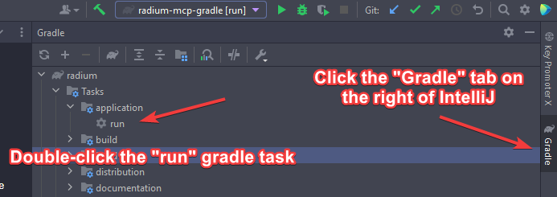

# Ketamine (Nov 13, 2021) client release
**NOTICE: I MAY FIX MINOR BUGS IN FUTURE BUT I HAVE NO PLANS TO MAINTAIN THIS REPOSITORY!**

I've decided to release the last build of Ketamine that was solely developed by me (there are other builds but they have other contributors i.e. Thomaz, Error). 
There are some bugs and missing features (color pickers, multiple configs, optifine, etc) but overall it's a pretty nice client.

## Contact
neva lack#4597

## How to run
If you wish to just run the client the "versions" folder executable JAR and JSON are available on the [Releases page](https://github.com/nevalackin/ketamine-public/releases) under the latest tag (for example Nov13-21). If you would like to modify the source code or build from source clone this repository via:
```shell
git clone https://github.com/nevalackin/ketamine-public.git ketamine
```
The resulting `ketamine` folder is a gradle project that can opened with your favorite IDE i.e. IntelliJ. 

To run the client from inside IntelliJ run the "run" gradle task as shown below: 

## Disclaimer
Don't copyright strike this repository, its purpose is to stop the spreading of malware from source releases and "versions" folder executable JAR releases.